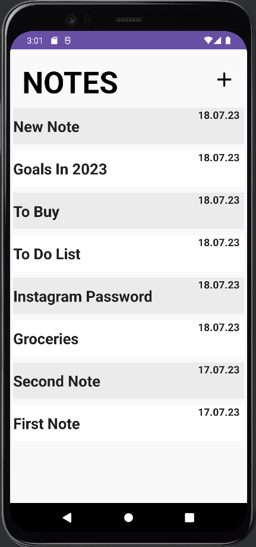
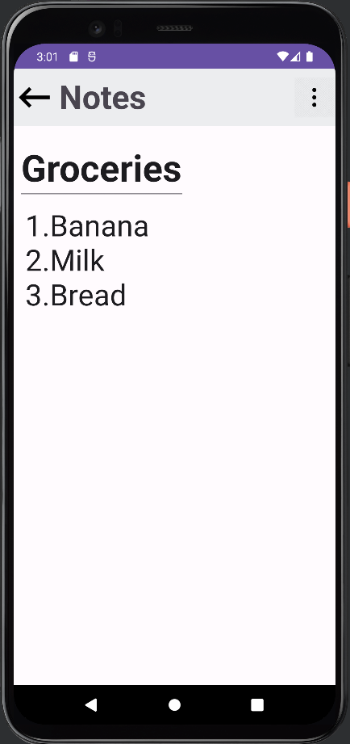
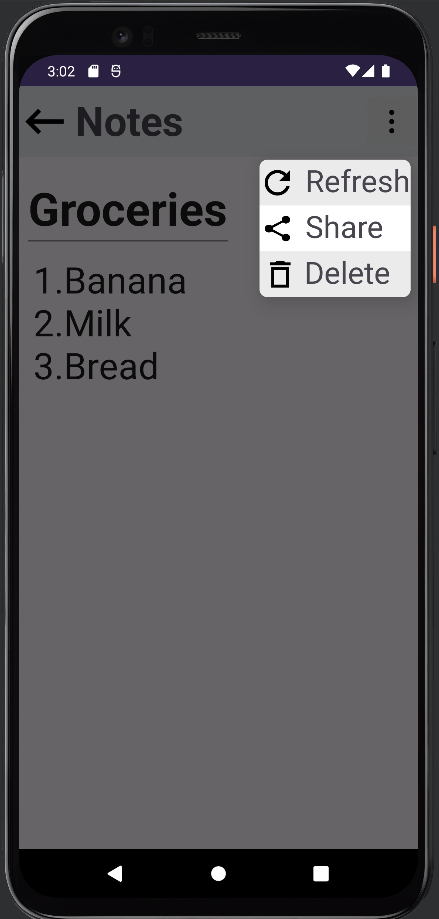

# My Notes App

My Notes App is a basic notes app that is written in Android Studio Kotlin. It utilizes Room Database to store the notes in this app.
 After the first time using databases in my workout app, I felt like I did not completely understand how the program interacts with the database. So, I started to build this app, which is mostly depended on database. And I can happily say that, I compeletely understood not just how to store the data in the database, but also how to take the data from database effectively. 

## Screenshots

1. **Screen Previews** - The first activity of the app, where screen previews of the notes are shown. You can click on any of these notes to open them or create a new note by clicking the add button.

   

2. **Notes Activity** - This activity displays a note with its title and content. It includes a toolbar for additional options.

   

3. **Options Dialog** - The dialog that opens when the three dots in the toolbar of the Notes Activity are clicked. It provides three buttons for resetting, sharing, and deleting the note.

   

## Features

- Create and save notes.
- View and edit existing notes.
- Reset, share, and delete notes.
- Intuitive user interface.

## Dependencies

The My Notes App uses the following dependencies:

- Room Database: For storing and managing notes.
- AndroidX libraries: For supporting modern Android features.
- Kotlin Coroutines: For asynchronous programming.

All necessary dependencies are specified in the app's Gradle files.
